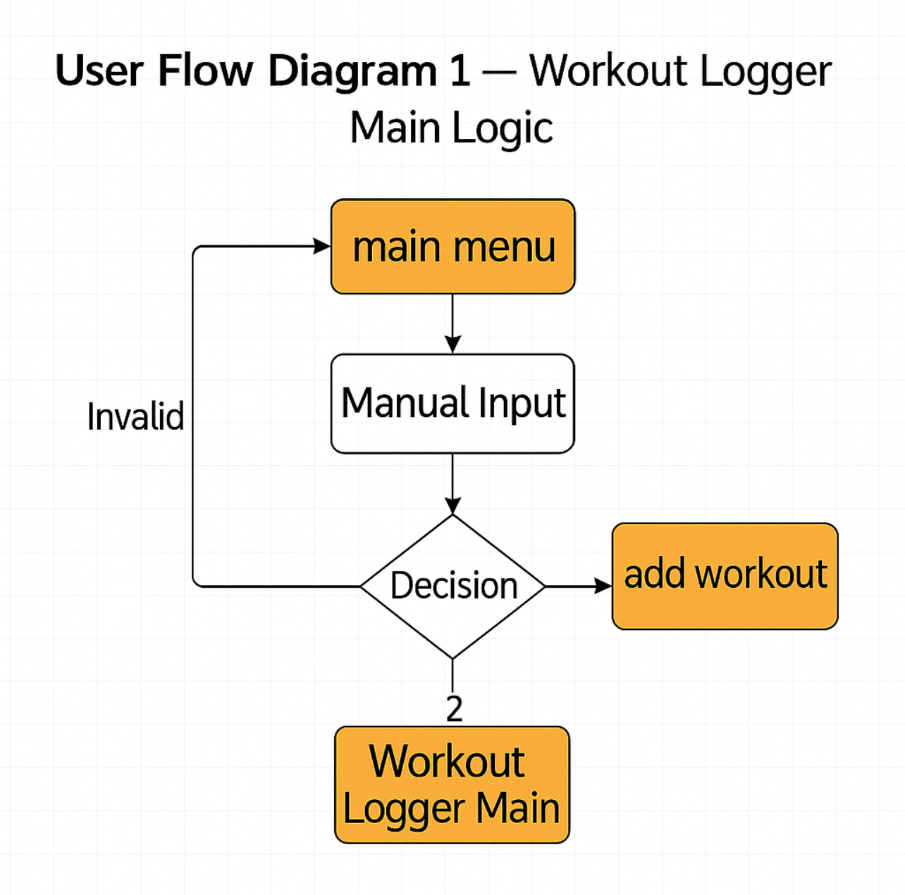
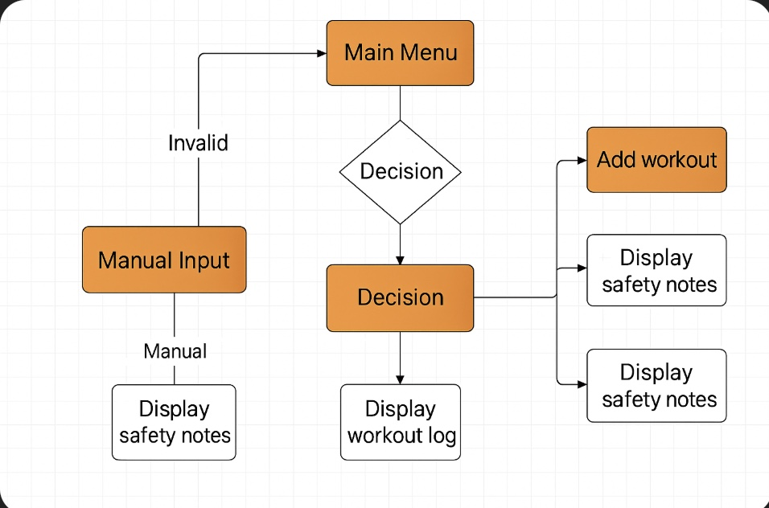
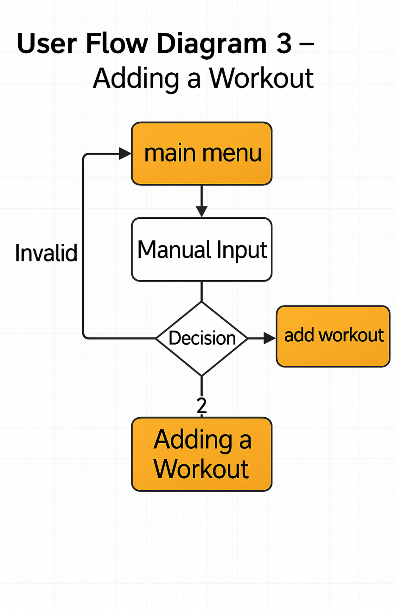

### 📘 Workout Logger – Command Line Python App


<hr style="border: none; height: 1px; background-color: #ddd; margin: 30px 0;" />

### 📖 Table of Contents

- Overview
- User Stories
- Structure
- Features
- Technologies Used
- Installation
- Usage
- Testing
- Deployment
- Version Control
- User Flow Diagrams
- Error Handling & Validation
- Features Left to Implement
- Credits
- License

<hr style="border: none; height: 1px; background-color: #ddd; margin: 30px 0;" />

### 🤩 Overview

Workout Logger is a command-line interface (CLI) application built in Python. The app allows users to log their workouts by entering type, duration, and intensity, while storing the information securely in a Google Sheet. It includes built-in safety guidance and a review option to see logged workouts.

<hr style="border: none; height: 1px; background-color: #ddd; margin: 30px 0;" />

### 👤 User Stories

- As a user, I want to log my workouts with type, duration, and intensity so I can track my fitness progress.
- As a user, I want to be informed about safety considerations before exercising to avoid injuries.
- As a user, I want to view a list of my previous workouts to stay motivated and monitor my habits.

<hr style="border: none; height: 1px; background-color: #ddd; margin: 30px 0;" />

### 🏋️️ Structure

#### Features

##### USER STORY
As a User, I would like to be able to easily find the various menus so that I can view information or add/edit records.

##### IMPLEMENTATION

**Main Menu**
- Options:
  - `1` – Add Workout
  - `2` – View Workouts
  - `3` – Exit

If invalid input is entered, the user is alerted and prompted again.


**Choice Prompt**


**Add Workout Flow**


**Successful Submission Message**


**Workout History View**


**Exit Confirmation**


<hr style="border: none; height: 1px; background-color: #ddd; margin: 30px 0;" />

### ✨ Features

- 💬 Safety pre-check information before workout logging
- ⌛ Input prompts for workout type, duration, and intensity
- ✅ Input validation and user guidance
- 🗓️ Google Sheets integration for persistent storage
- 📖 View workout history in an easy-to-read format

<hr style="border: none; height: 1px; background-color: #ddd; margin: 30px 0;" />

### 🛠️ Technologies Used

- Python 3.13
- Google Sheets API (gspread, google-auth)
- colorama for colored terminal output
- Git & GitHub for version control
- Heroku for deployment (backend CLI app)

<hr style="border: none; height: 1px; background-color: #ddd; margin: 30px 0;" />

### 🧰 Installation

```bash
git clone https://github.com/bobes81/workout-logger-final.git
cd workout-logger-final
pip install -r requirements.txt
```

Setup `CREDS_JSON` as an environment variable using your Google Service Account credentials.

<hr style="border: none; height: 1px; background-color: #ddd; margin: 30px 0;" />

### 🚀 Usage

Run the application locally:

```bash
python run.py
```

Use the terminal options to add new workouts or review history.

<hr style="border: none; height: 1px; background-color: #ddd; margin: 30px 0;" />

### 🧪 Testing

#### ✅ Input Validation

| Validation - Error Message | Expected Input Type | Is Error Displayed? |
| --- | --- | --- |
| Type of exercise | Text (letters only) | ✅ Yes |
| Duration in minutes | Integer > 0 | ✅ Yes |
| Intensity | "Low", "Medium", "High" | ✅ Yes |
| Safety Confirmation | Visual only (info prompt) | ✅ Yes |

#### 📝 Functionality Testing

| Function | Expected Behavior | Passed? |
| --- | --- | --- |
| run_safety_check() | Displays health & safety information | ✅ Yes |
| add_workout() | Validates input and logs data to Google Sheet | ✅ Yes |
| view_workouts() | Displays previously logged data | ✅ Yes |

#### ☁️ Google Sheets Integration

| Feature |
| --- |
| ✅ Successfully connects using `CREDS_JSON` environment variable |
| ✅ Appends workout entries correctly to the designated worksheet |
| ✅ Retrieves existing data for review |
| ✅ Handles connection errors gracefully |
| 🔒 Credentials are hidden from repository and included in `.gitignore` |

<hr style="border: none; height: 1px; background-color: #ddd; margin: 30px 0;" />

### ☁️ Deployment

- Deployed on Heroku using a Node.js server to handle terminal interaction.

Steps:
1. Create new app in Heroku.
2. Set `CREDS_JSON` under Config Vars.
3. Add Python and NodeJS buildpacks.
4. Connect GitHub repo.
5. Deploy branch.

Frontend (Static Site):
- `index.js` uses `node-pty` and `express.static()`.
- Terminal rendered via `xterm.js`.

<hr style="border: none; height: 1px; background-color: #ddd; margin: 30px 0;" />

### 🗂️ Version Control

- Separate branches for each new feature.
- Clear, descriptive commit messages.
- Local testing before merges.
- GitHub used for remote backups and Heroku integration.

<hr style="border: none; height: 1px; background-color: #ddd; margin: 30px 0;" />

### 🔍️ User Flow Diagrams

The following diagrams illustrate the logic and user flow of the Workout Logger CLI application. Each chart focuses on a different part of the user journey, from general navigation to safety guidance and workout entry.

#### 🔍 User Flow Diagram 1 – Workout Logger Main Logic

This diagram outlines the core navigation logic.
Users start at the main_menu(), provide manual input, and are routed based on valid or invalid decisions.

### 🧭 User Flow Diagram 1 – Workout Logger Main Logic



#### 🔍 User Flow Diagram 2 – Extended Workflow with Safety Layer

This chart includes a safety layer before logging a workout.
Users receive safety information before proceeding, with options to view logs or proceed to workout entry.



#### 🔍 User Flow Diagram 3 – Adding a Workout

This diagram focuses on the add_workout() process.
Users enter workout details, and upon validation, the workout is logged successfully.




<hr style="border: none; height: 1px; background-color: #ddd; margin: 30px 0;" />

### 🚑 Error Handling & Validation

USER STORY
- As a user, I want the application to guide me when I make a mistake, so I can correct it and continue without frustration.

IMPLEMENTATION
- Prompts re-displayed if invalid.
- Helpful error messages for wrong inputs.
- Connection errors caught and shown.
- Robust exception handling and validation.


<hr style="border: none; height: 1px; background-color: #ddd; margin: 30px 0;" />

### 🔧 Features Left to Implement

- 📊 Workout Statistics Overview
- 🔔 Reminders System
- 🗓️ Workout Scheduler
- 📈 Progress Graphs
- 🔐 User Authentication

<hr style="border: none; height: 1px; background-color: #ddd; margin: 30px 0;" />

### 👏 Credits

Code Institute – for curriculum structure, project templates and deployment guidance.

gspread – for working with Google Sheets API.

Google Auth – for secure API access.

Emojipedia – for emoji icons used throughout the README.

Stack Overflow – for debugging assistance and guidance on input validation patterns.

W3Schools Python Reference – used for Python syntax and logic refresher during development.

MDN Web Docs – used for HTML elements and attributes used in the frontend (xterm integration).

Heroku Documentation – for guidance on deploying both CLI and static frontend apps.

YouTube: Python CLI Projects – general inspiration and practices for CLI structure and interactivity.

xterm.js Documentation – for frontend terminal emulator setup.

ChatGPT – helped with code reviews and also with creation of pictures.

<hr style="border: none; height: 1px; background-color: #ddd; margin: 30px 0;" />

### 📄 License

This project is licensed under the MIT License.

