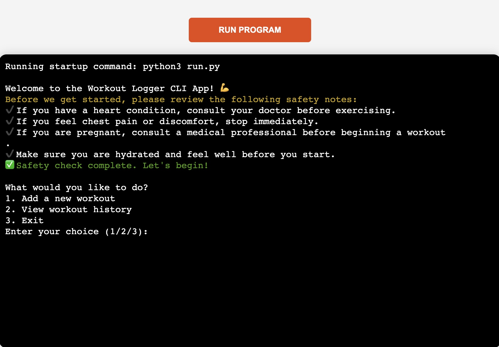
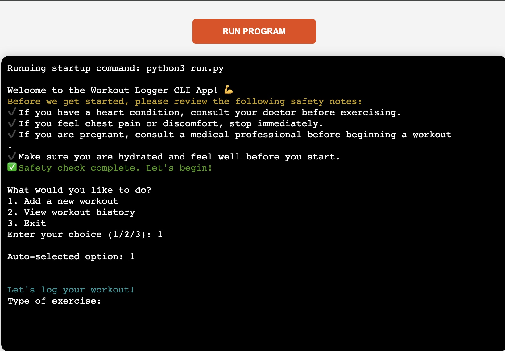
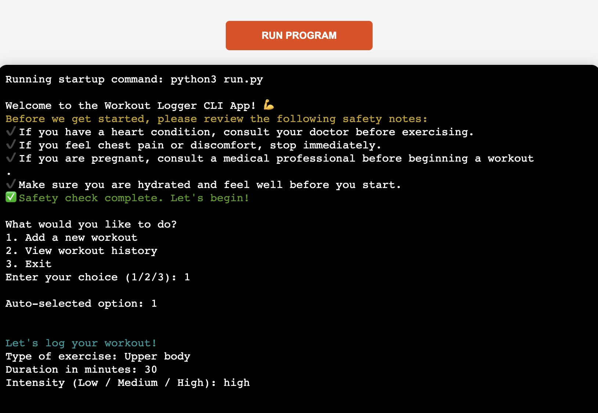
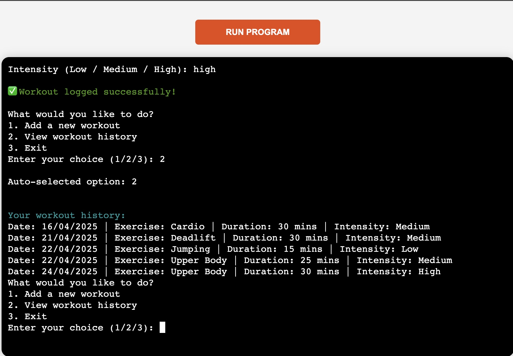
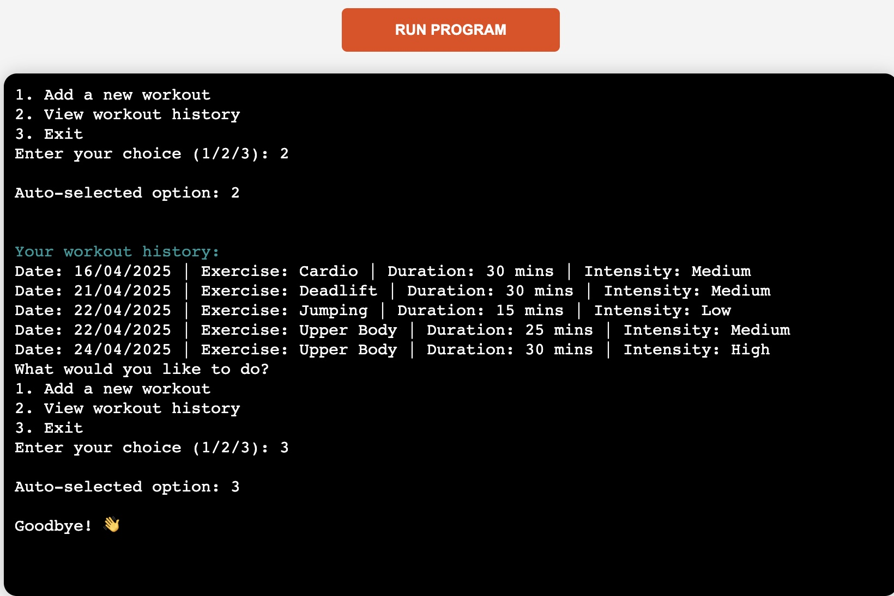
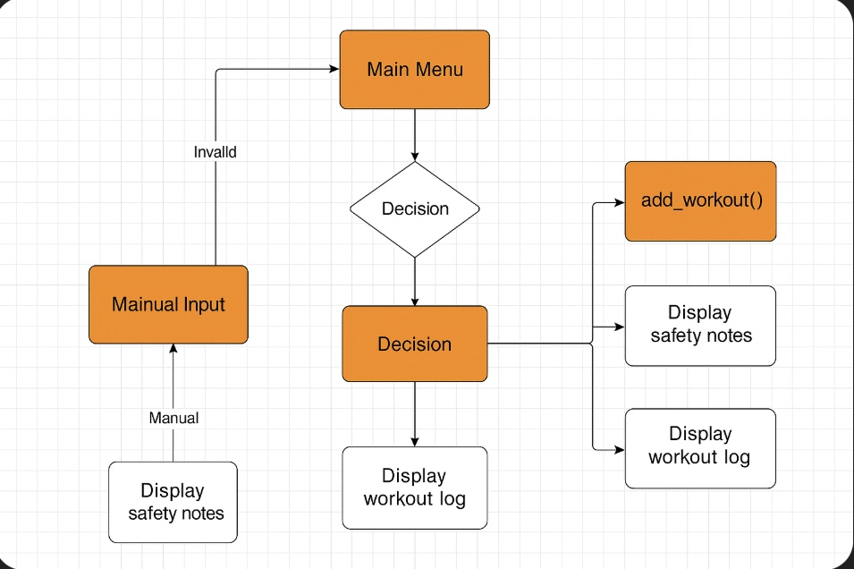

📘 Workout Logger – Command Line Python App


⸻

📖 Table of Contents
• Overview
• User Stories
• Structure
• Features
• Technologies Used
• Installation
• Usage
• Testing
• Deployment
• Version Control
• User Flow Diagrams
• Error Handling & Validation
• Features Left to Implement
• Credits
• License

⸻

🧩 Overview

Workout Logger is a command-line interface (CLI) application built in Python. The app allows users to log their workouts by entering type, duration, and intensity, while storing the information securely in a Google Sheet. It includes built-in safety guidance and a review option to see logged workouts.

⸻

👤 User Stories

As a user, I want to log my workouts with type, duration, and intensity so I can track my fitness progress.

As a user, I want to be informed about safety considerations before exercising to avoid injuries.

As a user, I want to view a list of my previous workouts to stay motivated and monitor my habits.

⸻

🏗️ Structure

### Features

#### USER STORY
As a User, I would like to be able to easily find the various menus so that I can view information or add / edit records.

#### IMPLEMENTATION

**Main Menu**
- When the application starts, a main menu will appear with the following options:
  - `1` – Add Workout
  - `2` – View Workouts
  - `3` – Exit
- The user must input a correct number corresponding to each menu or they will be alerted of an incorrect choice and the menu will be presented again.

This feature allows the user to easily access the main operations.



**Choice Prompt**
When a menu is shown, the user is prompted for a number.



**Add Workout Flow**



**Successful Submission Message**


**Workout History View**



**Exit Confirmation**



⸻

✨ Features
• 💬 Safety pre-check information before workout logging
• ⌛ Input prompts for workout type, duration, and intensity
• ✅ Input validation and user guidance
• 📅 Google Sheets integration for persistent storage
• 📖 View workout history in an easy-to-read format

⸻

🛠️ Technologies Used
• Python 3.13
• Google Sheets API (gspread, google-auth)
• colorama for colored terminal output
• Git & GitHub for version control
• Heroku for deployment (backend CLI app)

⸻

🧰 Installation
1. Clone this repository:
```bash
git clone https://github.com/bobes81/workout-logger-final.git
```
2. Navigate to the project folder:
```bash
cd workout-logger-final
```
3. Install dependencies:
```bash
pip install -r requirements.txt
```
4. Setup CREDS_JSON as environment variable using your Google Service Account credentials.

⸻

🚀 Usage
Run the application locally:
```bash
python run.py
```
Use the terminal options to add new workouts or review history.

⸻

🧪 Testing

✅ Input Validation
<div style="background-color: #ffffff; padding: 10px; border: 1px solid #ccc; border-radius: 8px; font-family: monospace;">
Validation - Error Message	Expected Input Type	Is Error Displayed?
Type of exercise	Text (letters only)	✅ Yes
Duration in minutes	Integer > 0	✅ Yes
Intensity	“Low”, “Medium”, “High”	✅ Yes
Safety Confirmation	Visual only (info prompt)	✅ Yes
</div>

📝 All fields were tested with both correct and incorrect inputs to confirm robust validation and user prompts.

🔁 Functionality Testing
<div style="background-color: #ffffff; padding: 10px; border: 1px solid #ccc; border-radius: 8px; font-family: monospace;">
Function	Expected Behavior	Passed?
run_safety_check()	Displays health & safety information	✅ Yes
add_workout()	Validates input and logs data to Google Sheet	✅ Yes
view_workouts()	Displays previously logged data	✅ Yes
</div>

☁️ Google Sheets Integration
<div style="background-color: #ffffff; padding: 10px; border: 1px solid #ccc; border-radius: 8px; font-family: monospace;">
✅ Successfully connects using `CREDS_JSON` environment variable<br>
✅ Appends workout entries correctly to the designated worksheet<br>
✅ Retrieves existing data for review<br>
✅ Handles connection errors gracefully<br>
🔒 Credentials are hidden from repository and included in `.gitignore`
</div>

⸻

☁️ Deployment

The Workout Logger CLI app is deployed on Heroku using a Node.js server to handle terminal interaction.

🔗 Live App on Heroku

Backend Deployment (Heroku CLI App)
1. Go to Heroku and click “New” → “Create new app”.
2. Choose a name and region.
3. Under Settings, add the CREDS_JSON environment variable under Config Vars.
4. Add Python and NodeJS buildpacks (Python first, then NodeJS).
5. Under Deploy, connect your GitHub repo.
6. Click “Deploy Branch” under Manual Deploy.

Frontend Terminal Setup (Xterm)
• index.js uses node-pty to run run.py and connect via WebSocket.
• HTML/CSS/JS frontend served from public/ folder using express.static().
• xterm.js renders the terminal interface in browser.
• .gitattributes hides frontend from language stats.

⸻

🗂️ Version Control
• Each new feature or improvement was implemented on a separate branch.
• Descriptive commit messages documented progress clearly.
• All changes were merged into main after local testing.
• GitHub ensured code backup and supported Heroku integration.

⸻

🧭 User Flow Diagrams

### 🧭 User Flow Diagram 1 – Workout Logger Main Logic


### 🧭 User Flow Diagram 2 – Extended Workflow with Safety Layer



### 🧭 User Flow Diagram 3 – Adding a Workout


⸻

🧯 Error Handling & Validation

USER STORY
As a user, I want the application to guide me when I make a mistake, so I can correct it and continue without frustration.

IMPLEMENTATION
• Prompts are re-displayed if input is invalid.
• Errors such as wrong menu options or incorrect exercise formats trigger feedback.
• Google Sheets connection errors are caught and clearly shown.
• The app avoids crashes by using exception handling and input validation.

CI Python Linter


⸻

🔧 Features Left to Implement

📊 Workout Statistics Overview
🔔 Reminders System
📆 Workout Scheduler
📈 Progress Graphs
🔐 User Authentication

⸻

👏 Credits
Code Institute – for curriculum structure, project templates and deployment guidance.

gspread – for working with Google Sheets API.

Google Auth – for secure API access.

Emojipedia – for emoji icons used throughout the README.

Stack Overflow – for debugging assistance and guidance on input validation patterns.

W3Schools Python Reference – used for Python syntax and logic refresher during development.

MDN Web Docs – used for HTML elements and attributes used in the frontend (xterm integration).

Heroku Documentation – for guidance on deploying both CLI and static frontend apps.

YouTube: Python CLI Projects – general inspiration and practices for CLI structure and interactivity.

xterm.js Documentation – for frontend terminal emulator setup.

ChatGPT – helped with code reviews and also with creation of pictures.
⸻

📄 License
This project is licensed under the MIT License.

